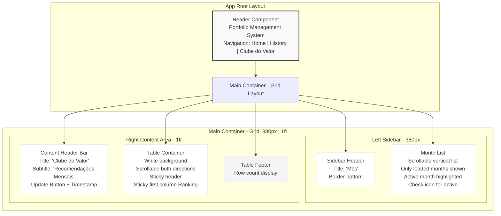

# Clube do Valor - Layout Redesign Specification

This document specifies the redesign of the Clube do Valor page to match the home page layout structure, fix table visibility issues, and improve navigation.

## Overview

The Clube do Valor page redesign aims to:
- Replicate the successful home page layout (user-list + portfolio pattern)
- Fix table visibility issues at full screen size
- Improve navigation by adding Home button to header
- Remove redundant back button from component
- Implement month-based filtering with only loaded months displayed
- Remove search functionality

## Current Issues

1. **Table Visibility**: Table not visible at full screen size, only appears when page is shrunk
2. **Layout Inconsistency**: Layout doesn't match the working home page design
3. **Duplicate Headers**: Multiple header sections causing layout conflicts
4. **Navigation**: Back button in component instead of header navigation
5. **Month Display**: Shows all months instead of only loaded months
6. **Search Bar**: Unnecessary search functionality that should be removed

## Page Structure Diagram



## Visual Layout Structure

### Home Page (User + Portfolio) - Current Working Design
```
┌─────────────────────────────────────────────────────────────────────┐
│  HEADER                                                             │
│  Portfolio Management System          [History] [Clube do Valor]    │
├──────────────────┬──────────────────────────────────────────────────┤
│                  │                                                  │
│  USER LIST       │  PORTFOLIO CONTENT                              │
│  (380px fixed)   │  (1fr - fills remaining space)                  │
│                  │                                                  │
│  ┌────────────┐  │  ┌──────────────────────────────────────────┐   │
│  │ Usuários   │  │  │ Carteira de Investimentos - [UserName]  │   │
│  │ [Create]   │  │  └──────────────────────────────────────────┘   │
│  └────────────┘  │                                                  │
│                  │  ┌──────────────────────────────────────────┐   │
│  ┌────────────┐  │  │ Upload PDF Component                    │   │
│  │ User 1     │  │  └──────────────────────────────────────────┘   │
│  │ User 2     │  │                                                  │
│  │ User 3     │  │  ┌──────────────────────────────────────────┐   │
│  │ ...        │  │  │ Positions Section                        │   │
│  │ (scroll)   │  │  └──────────────────────────────────────────┘   │
│  └────────────┘  │                                                  │
│                  │  ┌──────────────────────────────────────────┐   │
│                  │  │ Operations Table                         │   │
│                  │  │ [Scrollable - both directions]           │   │
│                  │  └──────────────────────────────────────────┘   │
│                  │                                                  │
└──────────────────┴──────────────────────────────────────────────────┘
```

### Clube do Valor - Proposed Design (Matching Home Page)
```
┌─────────────────────────────────────────────────────────────────────┐
│  HEADER                                                             │
│  Portfolio Management System  [Home] [History] [Clube do Valor]   │
├──────────────────┬──────────────────────────────────────────────────┤
│                  │                                                  │
│  MONTH SIDEBAR   │  CLUBE DO VALOR CONTENT                         │
│  (380px fixed)   │  (1fr - fills remaining space)                  │
│                  │                                                  │
│  ┌────────────┐  │  ┌──────────────────────────────────────────┐   │
│  │ Mês        │  │  │ Clube do Valor                           │   │
│  └────────────┘  │  │ Recomendações Mensais                    │   │
│                  │  │                    [Atualizar] [Timestamp]│   │
│  ┌────────────┐  │                                                  │
│  │ Jan 2024 ✓ │  │                                                  │
│  │ Feb 2024   │  │                                                  │
│  │ Mar 2024   │  │                                                  │
│  │ Apr 2024   │  │                                                  │
│  │ ...        │  │                                                  │
│  │ (only      │  │                                                  │
│  │  loaded)   │  │                                                  │
│  │ (scroll)   │  │  ┌──────────────────────────────────────────┐   │
│  └────────────┘  │  │ TABLE CONTAINER                           │   │
│                  │  │ ┌──────────────────────────────────────┐  │   │
│                  │  │ │ Ranking│Code│Yield│Name│...│Actions │  │  │
│                  │  │ │ [Sticky Header]                      │  │  │
│                  │  │ ├──────────────────────────────────────┤  │  │
│                  │  │ │   1    │ABC │ 5% │...│...│...│  X   │  │  │
│                  │  │ │   2    │XYZ │ 4% │...│...│...│  X   │  │  │
│                  │  │ │ [Scrollable - vertical + horizontal]│  │  │
│                  │  │ │ [Sticky Ranking Column]              │  │  │
│                  │  │ └──────────────────────────────────────┘  │  │
│                  │  └──────────────────────────────────────────┘   │
│                  │                                                  │
│                  │  ┌──────────────────────────────────────────┐   │
│                  │  │ Footer: "X ações"                      │   │
│                  │  └──────────────────────────────────────────┘   │
│                  │                                                  │
└──────────────────┴──────────────────────────────────────────────────┘
```

## Key Design Changes

### 1. Header Navigation
- **Add**: "Home" button between title and existing navigation links
- **Location**: `frontend/src/app/header/header.html`
- **Behavior**: Navigate back to home page (user-list + portfolio view)
- **Styling**: Match existing History and Clube do Valor button styles

### 2. Layout Structure
- **Grid Layout**: Match exact grid from home page (`380px | 1fr`)
- **Left Sidebar**: Month selection (380px fixed width)
- **Right Content**: Table and controls (1fr - fills remaining space)
- **Responsive**: Desktop (≥768px) side-by-side, Mobile (<768px) stacked

### 3. Month Filtering
- **Display**: Show only months that have loaded data (from history snapshots)
- **Source**: Load available months from `/api/clubedovalor/history/`
- **Filtering**: Filter stocks by selected month when month is clicked
- **Implementation**: Extract unique months from snapshot timestamps

### 4. Table Visibility Fixes
- **Issue**: Table hidden at full screen due to overflow constraints
- **Solution**: Remove problematic `overflow-x: hidden` media query
- **Layout**: Ensure table container uses flex layout properly
- **Scrolling**: Enable both vertical and horizontal scrolling as needed

### 5. Component Cleanup
- **Remove**: Back button from clubedovalor component
- **Remove**: Duplicate header sections from `app.html`
- **Remove**: Search bar and all search-related functionality
- **Remove**: Search-related CSS styles

## Implementation Details

### Files to Modify

#### Frontend Components

1. **Header Component**
   - `frontend/src/app/header/header.html` - Add Home button
   - `frontend/src/app/header/header.ts` - Add `showHome` event emitter
   - `frontend/src/app/header/header.css` - Style Home button

2. **App Component**
   - `frontend/src/app/app.html` - Remove duplicate headers, add home handler
   - `frontend/src/app/app.ts` - Add `onShowHome()` method
   - `frontend/src/app/app.css` - Remove `.clubedovalor-header` and `.clubedovalor-menu` styles

3. **Clube do Valor Component**
   - `frontend/src/app/clubedovalor/clubedovalor/clubedovalor.html` - Restructure layout, remove search bar
   - `frontend/src/app/clubedovalor/clubedovalor/clubedovalor.ts` - Update month loading, remove search logic
   - `frontend/src/app/clubedovalor/clubedovalor/clubedovalor.css` - Fix grid layout, remove search styles

### Implementation Steps

#### Step 1: Update Header Navigation
1. Add "Home" button to header HTML template
2. Add `@Output() showHome` event emitter to header component
3. Style Home button to match existing navigation buttons

#### Step 2: Update App Component
1. Add `onShowHome()` method to reset all views
2. Remove `clubedovalor-header` and `clubedovalor-menu` divs from template
3. Remove related CSS styles from `app.css`
4. Bind `(showHome)` event from header

#### Step 3: Redesign Clube do Valor Component Structure
1. Remove back button from menu-bar
2. Restructure HTML to match user-list + portfolio pattern
3. Move menu-bar (update button + timestamp) into content area header
4. Ensure proper grid column assignments

#### Step 4: Fix CSS Layout
1. Update `.month-sidebar` to be `grid-column: 1` with `width: 380px` on desktop
2. Update `.content-area` to be `grid-column: 2` with `flex: 1` on desktop
3. Remove problematic `overflow-x: hidden` media query
4. Ensure `.table-container` uses full available width
5. Fix flex layout for proper table visibility

#### Step 5: Implement Month Filtering
1. Load history snapshots on component init
2. Extract unique months from snapshot timestamps
3. Update `getMonths()` to return only available months
4. Update `selectMonth()` to load month-specific data
5. Update `loadStocks()` to accept optional month parameter

#### Step 6: Remove Search Functionality
1. Remove search-container div from HTML template
2. Remove `searchTerm` property from component
3. Remove search filtering logic from `applyFilters()`
4. Remove search-related CSS styles

## API Endpoints

### Existing Endpoints Used
- `GET /api/clubedovalor/` - Get current month's stocks
- `GET /api/clubedovalor/history/` - Get all historical snapshots
- `POST /api/clubedovalor/refresh/` - Refresh from Google Sheets
- `DELETE /api/clubedovalor/stocks/{codigo}/` - Delete stock

### Data Structure

#### History Response
```typescript
interface ClubeDoValorHistoryResponse {
  snapshots: Array<{
    timestamp: string;  // ISO 8601 format: "2024-01-15T10:30:00Z"
    data: Stock[];
  }>;
  count: number;
}
```

#### Month Extraction
- Extract month from timestamp: `YYYY-MM` format
- Example: `"2024-01-15T10:30:00Z"` → `"2024-01"`
- Display format: `"Janeiro 2024"` (Portuguese locale)

## CSS Grid Layout

### Desktop (≥768px)
```css
main {
  grid-template-columns: 380px 1fr;
  gap: 0;
}

.month-sidebar {
  grid-column: 1;
  width: 380px;
}

.content-area {
  grid-column: 2;
  flex: 1;
}
```

### Mobile (<768px)
```css
main {
  grid-template-columns: 1fr;
}

.month-sidebar {
  grid-column: 1 / -1;
  border-right: none;
  border-bottom: 1px solid #e5e5e7;
  max-height: 300px;
}

.content-area {
  grid-column: 1 / -1;
}
```

## Key Design Principles

1. **Consistent Layout**: Match exact grid structure from home page (380px sidebar + 1fr content)
2. **Full Width Table**: Table uses all available space in content area
3. **Proper Scrolling**: 
   - Sidebar: Vertical scroll for months
   - Table: Both vertical and horizontal scroll as needed
   - Sticky header and first column for better UX
4. **Navigation**: 
   - Add "Home" button in header navigation
   - Remove back button from clubedovalor component
5. **Clean Structure**: Remove duplicate headers and menu bars
6. **Month Filtering**: 
   - Show only months with loaded data
   - Filter stocks by selected month
   - Load month-specific data from history
7. **No Search**: Remove search functionality completely

## Responsive Behavior

- **Desktop (≥768px)**: Sidebar (380px) + Content (1fr) side by side
- **Mobile (<768px)**: Stacked layout, sidebar on top, content below

## Testing Checklist

- [ ] Home button appears in header navigation
- [ ] Home button navigates to user-list + portfolio view
- [ ] Back button removed from clubedovalor component
- [ ] Layout matches home page structure (380px | 1fr grid)
- [ ] Table visible at full screen size
- [ ] Table scrollable both vertically and horizontally
- [ ] Only loaded months shown in sidebar
- [ ] Month selection filters stocks correctly
- [ ] Search bar removed from component
- [ ] Responsive layout works on mobile devices
- [ ] Sticky header works during table scroll
- [ ] Sticky ranking column works during horizontal scroll

## Migration Notes

### Breaking Changes
- Search functionality removed (no search bar)
- Back button removed (use header navigation instead)
- Month list now shows only loaded months (not all months)

### Backward Compatibility
- API endpoints remain unchanged
- Data structure remains unchanged
- Only UI/UX changes, no data migration needed

---

**Document Version**: 1.0  
**Last Updated**: December 2024  
**Status**: Specification - Ready for Implementation

