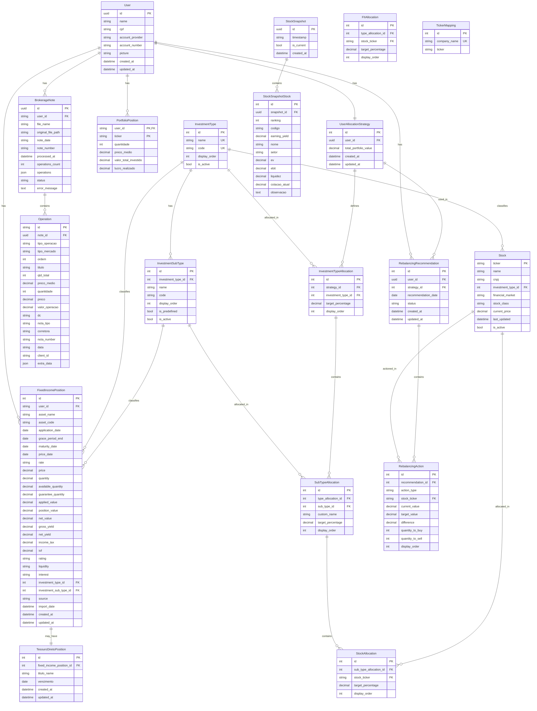

# Database Data Model Documentation

## Overview

This document provides comprehensive documentation of the database schema for the Portfolio Management System. The system uses SQLite for development and stores all data in Django models organized across multiple apps.

### Database Technology
- **Development**: SQLite 3
- **ORM**: Django ORM
- **Total Models**: 18 models across 10 Django apps

### Model Organization

The database models are organized into the following functional areas:

- **User Management**: User accounts and profiles
- **Brokerage Operations**: Brokerage notes and trading operations
- **Portfolio Management**: Portfolio positions and summaries
- **Fixed Income**: CDB, Tesouro Direto, and other fixed income investments
- **Stock Catalog**: Master stock catalog and ticker mappings
- **Investment Configuration**: Investment types and sub-types
- **Allocation Strategies**: User allocation strategies and targets
- **Rebalancing**: Rebalancing recommendations and actions
- **Clube do Valor**: Stock recommendations and snapshots

---

## Core Models Documentation

### Users App

#### User

**Table**: `users`

**Purpose**: Stores user account information including CPF, account provider, and profile picture.

**Fields**:

| Field Name | Type | Constraints | Description |
|------------|------|-------------|-------------|
| `id` | UUIDField | Primary Key, Auto-generated | Unique user identifier |
| `name` | CharField | max_length=255, Required | User's full name |
| `cpf` | CharField | max_length=20, Required | Brazilian CPF (tax ID) |
| `account_provider` | CharField | max_length=255, Required | Brokerage or bank name |
| `account_number` | CharField | max_length=100, Required | Account number at provider |
| `picture` | CharField | max_length=500, Null, Blank | Profile picture URL/path |
| `created_at` | DateTimeField | auto_now_add=True | Record creation timestamp |
| `updated_at` | DateTimeField | auto_now=True | Last update timestamp |

**Relationships**:
- One-to-One: `UserAllocationStrategy` (via `allocation_strategy` related_name)
- One-to-Many: `RebalancingRecommendation` (via `rebalancing_recommendations` related_name)

**Meta Options**:
- `db_table`: `users`
- `ordering`: `['name']`

---

### Brokerage Notes App

#### BrokerageNote

**Table**: `brokerage_notes`

**Purpose**: Stores processed brokerage note information including financial summary data extracted from PDFs.

**Table**: `brokerage_notes`

**Purpose**: Stores brokerage note metadata and operations as JSON. Tracks processing status and errors.

**Fields**:

| Field Name | Type | Constraints | Description |
|------------|------|-------------|-------------|
| `id` | UUIDField | Primary Key, Auto-generated | Unique note identifier |
| `user_id` | CharField | max_length=100, Required | User ID (stored as string) |
| `file_name` | CharField | max_length=255, Required | Original PDF filename |
| `original_file_path` | CharField | max_length=500, Null, Blank | File storage path |
| `note_date` | CharField | max_length=20, Required | Note date (DD/MM/YYYY format) |
| `note_number` | CharField | max_length=100, Required | Brokerage note number |
| `processed_at` | DateTimeField | Null, Blank | Processing timestamp |
| `operations_count` | IntegerField | default=0 | Number of operations in note |
| `operations` | JSONField | default=list | Operations stored as JSON array |
| `status` | CharField | max_length=20, default='success', choices | Processing status |
| `error_message` | TextField | Null, Blank | Error details if processing failed |
| **Financial Summary Fields** (all Null, Blank) | | | Extracted from last page of PDF |
| `debentures` | DecimalField | max_digits=12, decimal_places=2 | Resumo dos Negócios: Debentures |
| `vendas_a_vista` | DecimalField | max_digits=12, decimal_places=2 | Resumo dos Negócios: Vendas à vista |
| `compras_a_vista` | DecimalField | max_digits=12, decimal_places=2 | Resumo dos Negócios: Compras à vista |
| `valor_das_operacoes` | DecimalField | max_digits=12, decimal_places=2 | Resumo dos Negócios: Valor das operações |
| `clearing` | DecimalField | max_digits=12, decimal_places=2 | Resumo Financeiro: Clearing |
| `valor_liquido_operacoes` | DecimalField | max_digits=12, decimal_places=2 | Resumo Financeiro: Valor líquido das operações |
| `taxa_liquidacao` | DecimalField | max_digits=12, decimal_places=2 | Resumo Financeiro: Taxa de liquidação |
| `taxa_registro` | DecimalField | max_digits=12, decimal_places=2 | Resumo Financeiro: Taxa de registro |
| `total_cblc` | DecimalField | max_digits=12, decimal_places=2 | Resumo Financeiro: Total CBLC |
| `bolsa` | DecimalField | max_digits=12, decimal_places=2 | Resumo Financeiro: Bolsa |
| `emolumentos` | DecimalField | max_digits=12, decimal_places=2 | Resumo Financeiro: Emolumentos |
| `taxa_transferencia_ativos` | DecimalField | max_digits=12, decimal_places=2 | Resumo Financeiro: Taxa de transferência de ativos |
| `total_bovespa` | DecimalField | max_digits=12, decimal_places=2 | Resumo Financeiro: Total Bovespa |
| `taxa_operacional` | DecimalField | max_digits=12, decimal_places=2 | Custos Operacionais: Taxa operacional |
| `execucao` | DecimalField | max_digits=12, decimal_places=2 | Custos Operacionais: Execução |
| `taxa_custodia` | DecimalField | max_digits=12, decimal_places=2 | Custos Operacionais: Taxa de custódia |
| `impostos` | DecimalField | max_digits=12, decimal_places=2 | Custos Operacionais: Impostos |
| `irrf_operacoes` | DecimalField | max_digits=12, decimal_places=2 | Custos Operacionais: I.R.R.F. s/ operações |
| `irrf_base` | DecimalField | max_digits=12, decimal_places=2 | Custos Operacionais: I.R.R.F. s/ base |
| `outros_custos` | DecimalField | max_digits=12, decimal_places=2 | Custos Operacionais: Outros |
| `total_custos_despesas` | DecimalField | max_digits=12, decimal_places=2 | Custos Operacionais: Total de custos e despesas |
| `liquido` | DecimalField | max_digits=12, decimal_places=2 | Custos Operacionais: Líquido |
| `liquido_data` | CharField | max_length=20 | Custos Operacionais: Date for "Líquido para" |

**Status Choices**:
- `success`: All operations processed successfully
- `partial`: Some operations processed
- `failed`: Processing failed

**Relationships**:
- One-to-Many: `Operation` (via `operation_set` related_name)

**Meta Options**:
- `db_table`: `brokerage_notes`
- `ordering`: `['-note_date', '-note_number']`
- `unique_together`: `[['user_id', 'note_number', 'note_date']]`

#### Operation

**Table**: `operations`

**Purpose**: Stores individual trading operations extracted from brokerage notes.

**Fields**:

| Field Name | Type | Constraints | Description |
|------------|------|-------------|-------------|
| `id` | CharField | Primary Key, max_length=100 | Unique operation identifier |
| `note` | ForeignKey | BrokerageNote, CASCADE | Parent brokerage note |
| `tipo_operacao` | CharField | max_length=1, Required | Operation type: 'C' (Buy) or 'V' (Sell) |
| `tipo_mercado` | CharField | max_length=50, Null, Blank | Market type (e.g., "VISTA") |
| `ordem` | IntegerField | default=0 | Operation order in note |
| `titulo` | CharField | max_length=20, Required | Stock ticker symbol |
| `qtd_total` | IntegerField | default=0, Null, Blank | Total quantity |
| `preco_medio` | DecimalField | max_digits=10, decimal_places=2, Null, Blank | Average price |
| `quantidade` | IntegerField | Required | Quantity (negative for sales) |
| `preco` | DecimalField | max_digits=10, decimal_places=2, Required | Price per unit |
| `valor_operacao` | DecimalField | max_digits=12, decimal_places=2, Required | Total operation value |
| `dc` | CharField | max_length=1, Null, Blank | Debit/Credit indicator |
| `nota_tipo` | CharField | max_length=50, Null, Blank | Note type |
| `corretora` | CharField | max_length=100, Null, Blank | Brokerage name |
| `nota_number` | CharField | max_length=100, Null, Blank | Note number |
| `data` | CharField | max_length=20, Required | Operation date (DD/MM/YYYY) |
| `client_id` | CharField | max_length=100, Null, Blank | Client identifier |
| `extra_data` | JSONField | default=dict, Null, Blank | Additional flexible data |

**Relationships**:
- Many-to-One: `BrokerageNote` (via `note` ForeignKey)

**Meta Options**:
- `db_table`: `operations`
- `ordering`: `['data', 'ordem']`

---

### Portfolio Operations App

#### PortfolioPosition

**Table**: `portfolio_positions`

**Purpose**: Stores aggregated portfolio position summaries calculated from brokerage notes.

**Fields**:

| Field Name | Type | Constraints | Description |
|------------|------|-------------|-------------|
| `user_id` | CharField | max_length=100, db_index=True | User identifier |
| `ticker` | CharField | max_length=20, db_index=True | Stock ticker symbol |
| `quantidade` | IntegerField | default=0 | Current position quantity |
| `preco_medio` | DecimalField | max_digits=10, decimal_places=2, default=0.0 | Average purchase price |
| `valor_total_investido` | DecimalField | max_digits=12, decimal_places=2, default=0.0 | Total invested value |
| `lucro_realizado` | DecimalField | max_digits=12, decimal_places=2, default=0.0 | Realized profit/loss |

**Meta Options**:
- `db_table`: `portfolio_positions`
- `unique_together`: `[['user_id', 'ticker']]`
- `ordering`: `['ticker']`

---

### Fixed Income App

#### FixedIncomePosition

**Table**: `fixed_income_positions`

**Purpose**: Tracks CDB and other fixed income investment positions with detailed financial metrics.

**Fields**:

| Field Name | Type | Constraints | Description |
|------------|------|-------------|-------------|
| `user_id` | CharField | max_length=100, db_index=True | User identifier |
| `asset_name` | CharField | max_length=255, Required | Asset name (e.g., "CDB BANCO MASTER S/A - DEZ/2026") |
| `asset_code` | CharField | max_length=100, db_index=True | Asset code (e.g., "CDB PRE DU CDB1202HZPT") |
| `application_date` | DateField | Required | Application date |
| `grace_period_end` | DateField | Null, Blank | Grace period end date |
| `maturity_date` | DateField | Required | Maturity date |
| `price_date` | DateField | Null, Blank | Price reference date |
| `rate` | CharField | max_length=20, Null, Blank | Interest rate (e.g., "+9,00%") |
| `price` | DecimalField | max_digits=15, decimal_places=2, Null, Blank | Current price |
| `quantity` | DecimalField | max_digits=15, decimal_places=2, default=0 | Quantity |
| `available_quantity` | DecimalField | max_digits=15, decimal_places=2, default=0 | Available quantity |
| `guarantee_quantity` | DecimalField | max_digits=15, decimal_places=2, default=0 | Guarantee quantity |
| `applied_value` | DecimalField | max_digits=15, decimal_places=2, default=0 | Applied value |
| `position_value` | DecimalField | max_digits=15, decimal_places=2, default=0 | Current position value |
| `net_value` | DecimalField | max_digits=15, decimal_places=2, default=0 | Net value |
| `gross_yield` | DecimalField | max_digits=15, decimal_places=2, default=0 | Gross yield |
| `net_yield` | DecimalField | max_digits=15, decimal_places=2, default=0 | Net yield |
| `income_tax` | DecimalField | max_digits=15, decimal_places=2, default=0 | Income tax (IR) |
| `iof` | DecimalField | max_digits=15, decimal_places=2, default=0 | IOF tax |
| `rating` | CharField | max_length=100, Null, Blank | Credit rating (e.g., "CC Fitch") |
| `liquidity` | CharField | max_length=100, Null, Blank | Liquidity status (e.g., "Sem Liquidez") |
| `interest` | CharField | max_length=100, Null, Blank | Interest type |
| `investment_type` | ForeignKey | InvestmentType, PROTECT, Null, Blank | Investment type classification |
| `investment_sub_type` | ForeignKey | InvestmentSubType, PROTECT, Null, Blank | Investment sub-type classification |
| `source` | CharField | max_length=50, default='Manual Entry' | Data source (e.g., "Excel Import") |
| `import_date` | DateTimeField | Null, Blank | Import timestamp |
| `created_at` | DateTimeField | auto_now_add=True | Record creation timestamp |
| `updated_at` | DateTimeField | auto_now=True | Last update timestamp |

**Relationships**:
- Many-to-One: `InvestmentType` (via `investment_type` ForeignKey, related_name='fixed_income_positions')
- Many-to-One: `InvestmentSubType` (via `investment_sub_type` ForeignKey, related_name='fixed_income_positions')
- One-to-One: `TesouroDiretoPosition` (via `tesouro_direto` related_name)

**Meta Options**:
- `db_table`: `fixed_income_positions`
- `ordering`: `['-created_at']`
- `indexes`: 
  - `['user_id', 'asset_code']`
  - `['user_id', 'investment_type']`
  - `['maturity_date']`
- `unique_together`: `[['user_id', 'asset_code', 'application_date']]`

#### TesouroDiretoPosition

**Table**: `tesouro_direto_positions`

**Purpose**: Stores Brazilian government bond (Tesouro Direto) specific information linked to fixed income positions.

**Fields**:

| Field Name | Type | Constraints | Description |
|------------|------|-------------|-------------|
| `fixed_income_position` | OneToOneField | FixedIncomePosition, CASCADE, Null, Blank | Link to parent fixed income position |
| `titulo_name` | CharField | max_length=255, Required | Bond name (e.g., "Tesouro IPCA+ 2029") |
| `vencimento` | DateField | Required | Maturity date |
| `created_at` | DateTimeField | auto_now_add=True | Record creation timestamp |
| `updated_at` | DateTimeField | auto_now=True | Last update timestamp |

**Relationships**:
- One-to-One: `FixedIncomePosition` (via `fixed_income_position` OneToOneField)

**Meta Options**:
- `db_table`: `tesouro_direto_positions`
- `ordering`: `['vencimento']`
- `indexes`: `[['titulo_name', 'vencimento']]`

---

### Stocks App

#### Stock

**Table**: `stock_catalog`

**Purpose**: Master catalog of stocks with ticker symbols, company information, and current prices.

**Fields**:

| Field Name | Type | Constraints | Description |
|------------|------|-------------|-------------|
| `ticker` | CharField | max_length=20, unique=True, db_index=True | Stock ticker symbol (Primary Key) |
| `name` | CharField | max_length=255, Required | Company name |
| `cnpj` | CharField | max_length=18, Null, Blank | Brazilian company tax ID |
| `investment_type` | ForeignKey | InvestmentType, SET_NULL, Null, Blank | Investment type classification |
| `financial_market` | CharField | max_length=20, choices, default='B3' | Financial market |
| `stock_class` | CharField | max_length=10, choices, default='ON' | Stock class |
| `current_price` | DecimalField | max_digits=12, decimal_places=2, default=0.0 | Current stock price |
| `last_updated` | DateTimeField | auto_now=True | Last price update timestamp |
| `is_active` | BooleanField | default=True | Active status |

**Financial Market Choices**:
- `B3`: Brazilian stock exchange
- `Nasdaq`: NASDAQ
- `NYExchange`: New York Stock Exchange

**Stock Class Choices**:
- `ON`: Ordinary shares
- `PN`: Preferred shares
- `ETF`: Exchange-traded fund
- `BDR`: Brazilian Depositary Receipt

**Relationships**:
- Many-to-One: `InvestmentType` (via `investment_type` ForeignKey, related_name='stocks')
- One-to-Many: `StockAllocation` (via `allocations` related_name)
- One-to-Many: `RebalancingAction` (via `rebalancing_actions` related_name)

**Meta Options**:
- `db_table`: `stock_catalog`
- `ordering`: `['ticker']`

---

### Configuration App

#### InvestmentType

**Table**: `investment_types`

**Purpose**: Base investment categories (e.g., "Ações", "Renda Fixa", "Tesouro Direto").

**Fields**:

| Field Name | Type | Constraints | Description |
|------------|------|-------------|-------------|
| `id` | AutoField | Primary Key, Auto-generated | Unique identifier |
| `name` | CharField | max_length=255, unique=True | Investment type name |
| `code` | CharField | max_length=50, unique=True, db_index=True | Type code |
| `display_order` | IntegerField | default=0 | Display order for UI |
| `is_active` | BooleanField | default=True | Active status |

**Relationships**:
- One-to-Many: `InvestmentSubType` (via `sub_types` related_name)
- One-to-Many: `Stock` (via `stocks` related_name)
- One-to-Many: `FixedIncomePosition` (via `fixed_income_positions` related_name)
- One-to-Many: `InvestmentTypeAllocation` (via `allocations` related_name)

**Meta Options**:
- `db_table`: `investment_types`
- `ordering`: `['display_order', 'name']`

#### InvestmentSubType

**Table**: `investment_sub_types`

**Purpose**: Sub-categories within investment types (e.g., "CDB", "LCI", "LCA" under "Renda Fixa").

**Fields**:

| Field Name | Type | Constraints | Description |
|------------|------|-------------|-------------|
| `id` | AutoField | Primary Key, Auto-generated | Unique identifier |
| `investment_type` | ForeignKey | InvestmentType, CASCADE | Parent investment type |
| `name` | CharField | max_length=255, Required | Sub-type name |
| `code` | CharField | max_length=50, db_index=True | Sub-type code |
| `display_order` | IntegerField | default=0 | Display order for UI |
| `is_predefined` | BooleanField | default=False | Whether sub-type is predefined |
| `is_active` | BooleanField | default=True | Active status |

**Relationships**:
- Many-to-One: `InvestmentType` (via `investment_type` ForeignKey)
- One-to-Many: `FixedIncomePosition` (via `fixed_income_positions` related_name)
- One-to-Many: `SubTypeAllocation` (via `allocations` related_name)

**Meta Options**:
- `db_table`: `investment_sub_types`
- `ordering`: `['investment_type', 'display_order', 'name']`
- `unique_together`: `[['investment_type', 'code']]`

---

### Allocation Strategies App

#### UserAllocationStrategy

**Table**: `user_allocation_strategies`

**Purpose**: Links a user to their allocation strategy and stores total portfolio value.

**Fields**:

| Field Name | Type | Constraints | Description |
|------------|------|-------------|-------------|
| `id` | AutoField | Primary Key, Auto-generated | Unique identifier |
| `user` | OneToOneField | User, CASCADE | User (one strategy per user) |
| `total_portfolio_value` | DecimalField | max_digits=15, decimal_places=2, Null, Blank | Total portfolio value |
| `created_at` | DateTimeField | auto_now_add=True | Record creation timestamp |
| `updated_at` | DateTimeField | auto_now=True | Last update timestamp |

**Relationships**:
- One-to-One: `User` (via `user` OneToOneField, related_name='allocation_strategy')
- One-to-Many: `InvestmentTypeAllocation` (via `type_allocations` related_name)
- One-to-Many: `RebalancingRecommendation` (via `recommendations` related_name)

**Meta Options**:
- `db_table`: `user_allocation_strategies`
- `ordering`: `['user__name']`

#### InvestmentTypeAllocation

**Table**: `investment_type_allocations`

**Purpose**: Defines target allocation percentage for each investment type within a user's strategy.

**Fields**:

| Field Name | Type | Constraints | Description |
|------------|------|-------------|-------------|
| `id` | AutoField | Primary Key, Auto-generated | Unique identifier |
| `strategy` | ForeignKey | UserAllocationStrategy, CASCADE | Parent strategy |
| `investment_type` | ForeignKey | InvestmentType, CASCADE | Investment type |
| `target_percentage` | DecimalField | max_digits=5, decimal_places=2, validators | Target allocation percentage (0-100) |
| `display_order` | IntegerField | default=0 | Display order for UI |

**Validators**:
- `MinValueValidator(Decimal('0'))`
- `MaxValueValidator(Decimal('100'))`

**Relationships**:
- Many-to-One: `UserAllocationStrategy` (via `strategy` ForeignKey)
- Many-to-One: `InvestmentType` (via `investment_type` ForeignKey)
- One-to-Many: `SubTypeAllocation` (via `sub_type_allocations` related_name)
- One-to-Many: `FIIAllocation` (via `fii_allocations` related_name)

**Meta Options**:
- `db_table`: `investment_type_allocations`
- `ordering`: `['strategy', 'display_order']`
- `unique_together`: `[['strategy', 'investment_type']]`

#### SubTypeAllocation

**Table**: `sub_type_allocations`

**Purpose**: Defines sub-allocation percentages within an investment type allocation.

**Fields**:

| Field Name | Type | Constraints | Description |
|------------|------|-------------|-------------|
| `id` | AutoField | Primary Key, Auto-generated | Unique identifier |
| `type_allocation` | ForeignKey | InvestmentTypeAllocation, CASCADE | Parent type allocation |
| `sub_type` | ForeignKey | InvestmentSubType, SET_NULL, Null, Blank | Investment sub-type (optional) |
| `custom_name` | CharField | max_length=255, Null, Blank | Custom name if no sub-type |
| `target_percentage` | DecimalField | max_digits=5, decimal_places=2, validators | Target allocation percentage (0-100) |
| `display_order` | IntegerField | default=0 | Display order for UI |

**Validators**:
- `MinValueValidator(Decimal('0'))`
- `MaxValueValidator(Decimal('100'))`

**Relationships**:
- Many-to-One: `InvestmentTypeAllocation` (via `type_allocation` ForeignKey)
- Many-to-One: `InvestmentSubType` (via `sub_type` ForeignKey, related_name='allocations')
- One-to-Many: `StockAllocation` (via `stock_allocations` related_name)

**Meta Options**:
- `db_table`: `sub_type_allocations`
- `ordering`: `['type_allocation', 'display_order']`

#### StockAllocation

**Table**: `stock_allocations`

**Purpose**: Defines specific stock allocations within a sub-type allocation (for Ações strategies).

**Fields**:

| Field Name | Type | Constraints | Description |
|------------|------|-------------|-------------|
| `id` | AutoField | Primary Key, Auto-generated | Unique identifier |
| `sub_type_allocation` | ForeignKey | SubTypeAllocation, CASCADE | Parent sub-type allocation |
| `stock` | ForeignKey | Stock, CASCADE | Stock from catalog |
| `target_percentage` | DecimalField | max_digits=5, decimal_places=2, validators | Target allocation percentage (0-100) |
| `display_order` | IntegerField | default=0 | Display order for UI |

**Validators**:
- `MinValueValidator(Decimal('0'))`
- `MaxValueValidator(Decimal('100'))`

**Relationships**:
- Many-to-One: `SubTypeAllocation` (via `sub_type_allocation` ForeignKey)
- Many-to-One: `Stock` (via `stock` ForeignKey, related_name='allocations')

**Meta Options**:
- `db_table`: `stock_allocations`
- `ordering`: `['sub_type_allocation', 'display_order']`
- `unique_together`: `[['sub_type_allocation', 'stock']]`

#### FIIAllocation

**Table**: `fii_allocations`

**Purpose**: Defines FII allocations linking directly to InvestmentTypeAllocation (bypassing subtypes). Allows manual selection of up to 5 FIIs from the catalog with individual allocation percentages.

**Fields**:

| Field Name | Type | Constraints | Description |
|------------|------|-------------|-------------|
| `id` | AutoField | Primary Key, Auto-generated | Unique identifier |
| `type_allocation` | ForeignKey | InvestmentTypeAllocation, CASCADE | Parent type allocation |
| `stock` | ForeignKey | Stock, CASCADE | FII stock (stock_class='FII') from catalog |
| `target_percentage` | DecimalField | max_digits=5, decimal_places=2, validators | Target allocation percentage (0-100) |
| `display_order` | IntegerField | default=0 | Display order for UI |

**Validators**:
- `MinValueValidator(Decimal('0'))`
- `MaxValueValidator(Decimal('100'))`

**Relationships**:
- Many-to-One: `InvestmentTypeAllocation` (via `type_allocation` ForeignKey)
- Many-to-One: `Stock` (via `stock` ForeignKey, related_name='fii_allocations')

**Meta Options**:
- `db_table`: `fii_allocations`
- `ordering`: `['type_allocation', 'display_order']`
- `unique_together`: `[['type_allocation', 'stock']]`

**Business Rules**:
- Maximum 5 FIIs per InvestmentTypeAllocation
- FII allocations must sum to 100% of the parent type allocation percentage
- Only FII stocks (stock_class='FII') can be allocated
- Used only for "Fundos Imobiliários" investment type (bypasses subtype allocations)

---

### Ticker Mappings App

#### TickerMapping

**Table**: `ticker_mappings`

**Purpose**: Maps company names (with classification codes) to stock ticker symbols for PDF parsing.

**Fields**:

| Field Name | Type | Constraints | Description |
|------------|------|-------------|-------------|
| `id` | AutoField | Primary Key, Auto-generated | Unique identifier |
| `company_name` | CharField | max_length=255, unique=True, db_index=True | Company name with classification (e.g., "3TENTOS ON NM") |
| `ticker` | CharField | max_length=20, Required | Stock ticker symbol |

**Meta Options**:
- `db_table`: `ticker_mappings`
- `ordering`: `['company_name']`

---

### Clube do Valor App

#### StockSnapshot

**Table**: `stock_snapshots`

**Purpose**: Stores monthly snapshots of stock recommendations from Clube do Valor.

**Fields**:

| Field Name | Type | Constraints | Description |
|------------|------|-------------|-------------|
| `id` | UUIDField | Primary Key, Auto-generated | Unique snapshot identifier |
| `timestamp` | CharField | max_length=50, Required | ISO 8601 format timestamp string |
| `is_current` | BooleanField | default=False, db_index=True | Whether this is the current snapshot |
| `created_at` | DateTimeField | auto_now_add=True | Record creation timestamp |

**Relationships**:
- One-to-Many: `Stock` (via `stocks` related_name) - Note: This is clubedovalor.Stock, not stocks.Stock

**Meta Options**:
- `db_table`: `stock_snapshots`
- `ordering`: `['-timestamp']`

#### Stock (Clube do Valor)

**Table**: `stocks`

**Purpose**: Stores individual stock data within a Clube do Valor snapshot (ranking, metrics, etc.).

**Note**: This is a different model from `stocks.Stock` (stock catalog). They serve different purposes.

**Fields**:

| Field Name | Type | Constraints | Description |
|------------|------|-------------|-------------|
| `id` | AutoField | Primary Key, Auto-generated | Unique identifier |
| `snapshot` | ForeignKey | StockSnapshot, CASCADE | Parent snapshot |
| `ranking` | IntegerField | Required | Stock ranking (1-126) |
| `codigo` | CharField | max_length=20, db_index=True | Stock ticker code |
| `earning_yield` | DecimalField | max_digits=6, decimal_places=2, Required | Earning yield percentage |
| `nome` | CharField | max_length=255, Required | Company name |
| `setor` | CharField | max_length=255, Required | Sector |
| `ev` | DecimalField | max_digits=15, decimal_places=2, Required | Enterprise value |
| `ebit` | DecimalField | max_digits=15, decimal_places=2, Required | EBIT |
| `liquidez` | DecimalField | max_digits=12, decimal_places=2, Required | Liquidity |
| `cotacao_atual` | DecimalField | max_digits=10, decimal_places=2, Required | Current price |
| `observacao` | TextField | blank=True, default='' | Additional notes |

**Relationships**:
- Many-to-One: `StockSnapshot` (via `snapshot` ForeignKey)

**Meta Options**:
- `db_table`: `stocks`
- `ordering`: `['ranking']`
- `unique_together`: `[['snapshot', 'codigo']]`

---

### Rebalancing App

#### RebalancingRecommendation

**Table**: `rebalancing_recommendations`

**Purpose**: Stores monthly rebalancing recommendations for users based on their allocation strategies.

**Fields**:

| Field Name | Type | Constraints | Description |
|------------|------|-------------|-------------|
| `id` | AutoField | Primary Key, Auto-generated | Unique identifier |
| `user` | ForeignKey | User, CASCADE | User |
| `strategy` | ForeignKey | UserAllocationStrategy, CASCADE | Allocation strategy |
| `recommendation_date` | DateField | Required | Recommendation date |
| `status` | CharField | max_length=20, choices, default='pending' | Recommendation status |
| `created_at` | DateTimeField | auto_now_add=True | Record creation timestamp |
| `updated_at` | DateTimeField | auto_now=True | Last update timestamp |

**Status Choices**:
- `pending`: Recommendation pending user action
- `applied`: Recommendation has been applied
- `dismissed`: Recommendation was dismissed

**Relationships**:
- Many-to-One: `User` (via `user` ForeignKey, related_name='rebalancing_recommendations')
- Many-to-One: `UserAllocationStrategy` (via `strategy` ForeignKey, related_name='recommendations')
- One-to-Many: `RebalancingAction` (via `actions` related_name)

**Meta Options**:
- `db_table`: `rebalancing_recommendations`
- `ordering`: `['-recommendation_date', '-created_at']`

#### RebalancingAction

**Table**: `rebalancing_actions`

**Purpose**: Stores individual buy/sell/rebalance actions within a recommendation.

**Fields**:

| Field Name | Type | Constraints | Description |
|------------|------|-------------|-------------|
| `id` | AutoField | Primary Key, Auto-generated | Unique identifier |
| `recommendation` | ForeignKey | RebalancingRecommendation, CASCADE | Parent recommendation |
| `action_type` | CharField | max_length=20, choices, Required | Action type |
| `stock` | ForeignKey | Stock, SET_NULL, Null, Blank | Stock from catalog |
| `current_value` | DecimalField | max_digits=15, decimal_places=2, default=0.0 | Current position value |
| `target_value` | DecimalField | max_digits=15, decimal_places=2, default=0.0 | Target position value |
| `difference` | DecimalField | max_digits=15, decimal_places=2, default=0.0 | Value difference |
| `quantity_to_buy` | IntegerField | Null, Blank | Quantity to buy |
| `quantity_to_sell` | IntegerField | Null, Blank | Quantity to sell |
| `display_order` | IntegerField | default=0 | Display order for UI |

**Action Type Choices**:
- `buy`: Buy action
- `sell`: Sell action
- `rebalance`: Rebalance action

**Relationships**:
- Many-to-One: `RebalancingRecommendation` (via `recommendation` ForeignKey)
- Many-to-One: `Stock` (via `stock` ForeignKey, related_name='rebalancing_actions')

**Meta Options**:
- `db_table`: `rebalancing_actions`
- `ordering`: `['recommendation', 'display_order']`

---

## Entity Relationship Diagram

The following Mermaid diagram shows all models and their relationships:

---

## Key Relationships Summary

### User-Centric Relationships

- **User → BrokerageNote** (One-to-Many): A user can have multiple brokerage notes
- **User → PortfolioPosition** (One-to-Many): A user can have multiple portfolio positions
- **User → FixedIncomePosition** (One-to-Many): A user can have multiple fixed income positions
- **User → UserAllocationStrategy** (One-to-One): Each user has one allocation strategy
- **User → RebalancingRecommendation** (One-to-Many): A user can have multiple rebalancing recommendations

### Brokerage Note Relationships

- **BrokerageNote → Operation** (One-to-Many): A brokerage note contains multiple operations

### Investment Classification Relationships

- **InvestmentType → InvestmentSubType** (One-to-Many): An investment type has multiple sub-types
- **InvestmentType → Stock** (One-to-Many): Stocks are classified by investment type
- **InvestmentType → FixedIncomePosition** (One-to-Many): Fixed income positions are classified by type
- **InvestmentSubType → FixedIncomePosition** (One-to-Many): Fixed income positions can be further classified by sub-type

### Allocation Strategy Relationships

- **UserAllocationStrategy → InvestmentTypeAllocation** (One-to-Many): A strategy defines allocations for multiple investment types
- **InvestmentTypeAllocation → SubTypeAllocation** (One-to-Many): A type allocation contains multiple sub-type allocations
- **SubTypeAllocation → StockAllocation** (One-to-Many): A sub-type allocation can contain multiple stock allocations
- **Stock → StockAllocation** (One-to-Many): A stock can be allocated in multiple strategies
- **InvestmentTypeAllocation → FIIAllocation** (One-to-Many): A type allocation can contain multiple FII allocations (for FII investment type)
- **Stock → FIIAllocation** (One-to-Many): A FII stock can be allocated in multiple strategies

### Fixed Income Relationships

- **FixedIncomePosition → TesouroDiretoPosition** (One-to-One): A fixed income position may have Tesouro Direto specific data

### Rebalancing Relationships

- **RebalancingRecommendation → RebalancingAction** (One-to-Many): A recommendation contains multiple actions
- **Stock → RebalancingAction** (One-to-Many): A stock can be involved in multiple rebalancing actions

### Clube do Valor Relationships

- **StockSnapshot → Stock** (One-to-Many): A snapshot contains multiple stock recommendations

---

## Indexes and Performance

### Primary Indexes

All models use primary keys that are automatically indexed:
- UUID primary keys: `User.id`, `BrokerageNote.id`, `StockSnapshot.id`
- Auto-incrementing integer primary keys: Most other models
- String primary key: `Stock.ticker`, `Operation.id`

### Foreign Key Indexes

Django automatically creates indexes on ForeignKey fields. Additionally, explicit indexes are defined:

**FixedIncomePosition**:
- Composite index on `['user_id', 'asset_code']` - Fast lookup by user and asset
- Composite index on `['user_id', 'investment_type']` - Fast filtering by user and type
- Index on `['maturity_date']` - Fast queries by maturity date

**TesouroDiretoPosition**:
- Composite index on `['titulo_name', 'vencimento']` - Fast lookup by bond name and maturity

**PortfolioPosition**:
- Index on `user_id` (db_index=True) - Fast user portfolio queries
- Index on `ticker` (db_index=True) - Fast ticker lookups

**StockSnapshot**:
- Index on `is_current` (db_index=True) - Fast current snapshot queries

**TickerMapping**:
- Index on `company_name` (db_index=True) - Fast company name lookups

**InvestmentSubType**:
- Index on `code` (db_index=True) - Fast code lookups

**InvestmentType**:
- Index on `code` (db_index=True) - Fast code lookups

**Stock (Clube do Valor)**:
- Index on `codigo` (db_index=True) - Fast ticker code lookups

### Unique Constraints

**Single Field Unique**:
- `User.id` (UUID primary key)
- `BrokerageNote.id` (UUID primary key)
- `Stock.ticker` (string primary key)
- `InvestmentType.name` (unique)
- `InvestmentType.code` (unique)
- `TickerMapping.company_name` (unique)
- `StockSnapshot.id` (UUID primary key)

**Composite Unique (unique_together)**:
- `BrokerageNote`: `['user_id', 'note_number', 'note_date']` - Prevents duplicate notes
- `PortfolioPosition`: `['user_id', 'ticker']` - One position per user/ticker combination
- `FixedIncomePosition`: `['user_id', 'asset_code', 'application_date']` - Prevents duplicate positions
- `InvestmentSubType`: `['investment_type', 'code']` - Unique code per type
- `InvestmentTypeAllocation`: `['strategy', 'investment_type']` - One allocation per type per strategy
- `StockAllocation`: `['sub_type_allocation', 'stock']` - One allocation per stock per sub-type
- `FIIAllocation`: `['type_allocation', 'stock']` - One FII allocation per stock per type allocation
- `StockSnapshotStock`: `['snapshot', 'codigo']` - One stock per snapshot

---

## Constraints and Validations

### Field Validators

**Percentage Validators** (MinValueValidator(0), MaxValueValidator(100)):
- `InvestmentTypeAllocation.target_percentage`
- `SubTypeAllocation.target_percentage`
- `StockAllocation.target_percentage`
- `FIIAllocation.target_percentage`

### Choice Fields

**BrokerageNote.status**:
- `success`: All operations processed successfully
- `partial`: Some operations processed
- `failed`: Processing failed

**Stock.financial_market**:
- `B3`: Brazilian stock exchange
- `Nasdaq`: NASDAQ
- `NYExchange`: New York Stock Exchange

**Stock.stock_class**:
- `ON`: Ordinary shares
- `PN`: Preferred shares
- `ETF`: Exchange-traded fund
- `BDR`: Brazilian Depositary Receipt

**RebalancingRecommendation.status**:
- `pending`: Recommendation pending user action
- `applied`: Recommendation has been applied
- `dismissed`: Recommendation was dismissed

**RebalancingAction.action_type**:
- `buy`: Buy action
- `sell`: Sell action
- `rebalance`: Rebalance action

### Cascade Behaviors

**CASCADE** (deletes related records):
- `BrokerageNote` → `Operation` (when note is deleted, operations are deleted)
- `User` → `UserAllocationStrategy` (when user is deleted, strategy is deleted)
- `UserAllocationStrategy` → `InvestmentTypeAllocation` (when strategy is deleted, allocations are deleted)
- `InvestmentTypeAllocation` → `SubTypeAllocation` (when type allocation is deleted, sub-allocations are deleted)
- `SubTypeAllocation` → `StockAllocation` (when sub-allocation is deleted, stock allocations are deleted)
- `InvestmentType` → `InvestmentSubType` (when type is deleted, sub-types are deleted)
- `StockSnapshot` → `Stock` (when snapshot is deleted, stocks are deleted)
- `RebalancingRecommendation` → `RebalancingAction` (when recommendation is deleted, actions are deleted)
- `FixedIncomePosition` → `TesouroDiretoPosition` (when position is deleted, Tesouro data is deleted)

**SET_NULL** (sets foreign key to NULL):
- `Stock.investment_type` (when investment type is deleted, stock type is set to NULL)
- `RebalancingAction.stock` (when stock is deleted, action stock is set to NULL)
- `SubTypeAllocation.sub_type` (when sub-type is deleted, allocation sub-type is set to NULL)

**PROTECT** (prevents deletion if related records exist):
- `FixedIncomePosition.investment_type` (prevents deletion of type if positions reference it)
- `FixedIncomePosition.investment_sub_type` (prevents deletion of sub-type if positions reference it)

---

## Data Types Reference

### UUID Fields

Used for primary keys that need to be globally unique:
- `User.id`: UUID v4, auto-generated
- `BrokerageNote.id`: UUID v4, auto-generated
- `StockSnapshot.id`: UUID v4, auto-generated

**Usage**: UUIDs are used when records need unique identifiers that don't reveal sequence or count information.

### Decimal Fields

Used for financial values with precise decimal representation:

**Common Precision Patterns**:
- `max_digits=15, decimal_places=2`: Large monetary values (e.g., portfolio values, position values)
- `max_digits=12, decimal_places=2`: Medium monetary values (e.g., operation values, prices)
- `max_digits=10, decimal_places=2`: Standard prices and quantities
- `max_digits=6, decimal_places=2`: Percentages and yields (e.g., earning_yield)
- `max_digits=5, decimal_places=2`: Allocation percentages (0-100)

**Examples**:
- `FixedIncomePosition.position_value`: 15,2 (supports values up to 999,999,999,999,999.99)
- `Stock.current_price`: 12,2 (supports prices up to 9,999,999,999.99)
- `InvestmentTypeAllocation.target_percentage`: 5,2 (supports percentages 0.00-100.00)

### CharField Usage

**Common Length Patterns**:
- `max_length=255`: Standard text fields (names, descriptions)
- `max_length=100`: Short identifiers (codes, account numbers)
- `max_length=50`: Very short codes (status, types)
- `max_length=20`: Ticker symbols, short codes
- `max_length=500`: File paths, URLs

**Special Cases**:
- `BrokerageNote.note_date`: Stored as string in DD/MM/YYYY format (not DateField)
- `Operation.data`: Stored as string in DD/MM/YYYY format (not DateField)
- `StockSnapshot.timestamp`: Stored as ISO 8601 string (not DateTimeField)

### Date vs DateTime Fields

**DateField**: Used for dates without time component
- `FixedIncomePosition.application_date`
- `FixedIncomePosition.maturity_date`
- `RebalancingRecommendation.recommendation_date`

**DateTimeField**: Used for timestamps with time component
- `User.created_at`, `User.updated_at`
- `BrokerageNote.processed_at`
- `FixedIncomePosition.import_date`, `created_at`, `updated_at`

### JSONField Usage

**BrokerageNote.operations**: Stores array of operation objects as JSON
- Allows flexible storage of operation data
- Enables denormalized storage for fast retrieval
- Operations are also stored in `Operation` model for querying

**Operation.extra_data**: Stores additional flexible data as JSON object
- Allows extension without schema changes
- Used for fields that may vary by operation type

---

## Migration Notes

### Database Evolution

The database schema has evolved through Django migrations. Key migration files:

- **Initial migrations**: Each app has `0001_initial.py` creating base tables
- **Status fields**: `brokerage_notes/migrations/0002_add_status_fields.py` added `status` and `error_message` to `BrokerageNote`

### Important Schema Decisions

1. **User ID Storage**: `user_id` fields are stored as `CharField` rather than `ForeignKey` to maintain compatibility with existing UUID string format. Relationships are maintained at application level.

2. **Date String Storage**: Some date fields (`note_date`, `data`) are stored as strings in DD/MM/YYYY format rather than DateField to match existing data format.

3. **Dual Stock Models**: Two separate `Stock` models exist:
   - `stocks.Stock`: Master stock catalog
   - `clubedovalor.Stock`: Snapshot-specific stock data
   These serve different purposes and are not related.

4. **JSON Operations**: `BrokerageNote.operations` stores operations as JSON for fast retrieval, while `Operation` model provides normalized querying capability.

5. **OneToOne vs ForeignKey**: `UserAllocationStrategy` uses OneToOne relationship with `User` to enforce one strategy per user, while `FixedIncomePosition` → `TesouroDiretoPosition` uses OneToOne for optional extension.

---

## Related Documentation

- **User Management**: See `01-user-management.md` for user-related functionality
- **Brokerage Note Processing**: See `02-brokerage-note-processing.md` for note processing details
- **Brokerage History**: See `03-brokerage-history.md` for history tracking
- **Portfolio Summary**: See `04-portfolio-summary.md` for portfolio functionality

---

**Document Version**: 1.0  
**Last Updated**: November 2025  
**Status**: Complete

