# Rebalancing Frontend Design

## Overview

This document describes the frontend design and layout structure of the Rebalancing page using Mermaid diagrams. The page provides portfolio summary information and displays rebalancing recommendations organized by investment types and subtypes.

## Page Structure

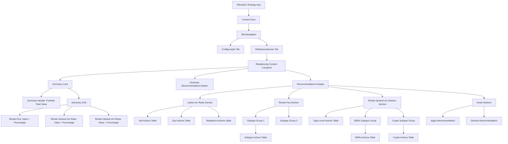

## Component Hierarchy

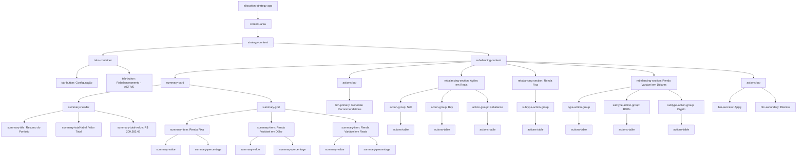

## Summary Card Layout

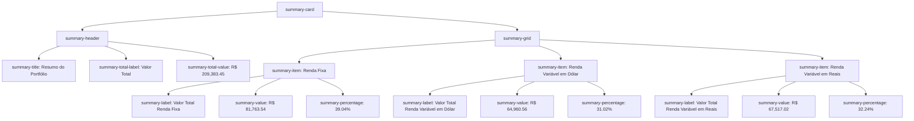

## Renda Variável em Dólares Section Structure

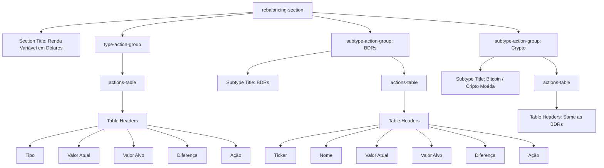

## Data Flow

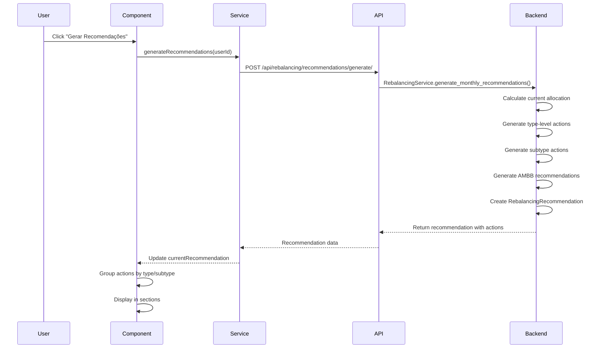

## Styling Structure

```mermaid
graph TD
    A[Design System Variables] --> B[Colors]
    A --> C[Spacing]
    A --> D[Typography]
    
    B --> B1[--primary-blue: #0071e3]
    B --> B2[--background: #f5f5f7]
    B --> B3[--white: #ffffff]
    B --> B4[--text-primary: #1d1d1f]
    
    E[Component Classes] --> F[summary-card]
    E --> G[rebalancing-section]
    E --> H[actions-table]
    E --> I[badge classes]
    
    F --> F1[White background]
    F --> F2[Rounded corners]
    F --> F3[Box shadow]
    
    G --> G1[Section title styling]
    G --> G2[Subtype group spacing]
    
    H --> H1[Table borders]
    H --> H2[Row hover effects]
    H --> H3[Alternating row colors]
    
    I --> I1[badge-buy: Green]
    I --> I2[badge-sell: Red]
    I --> I3[badge-maintain: Yellow]
```

## Mockup Layout

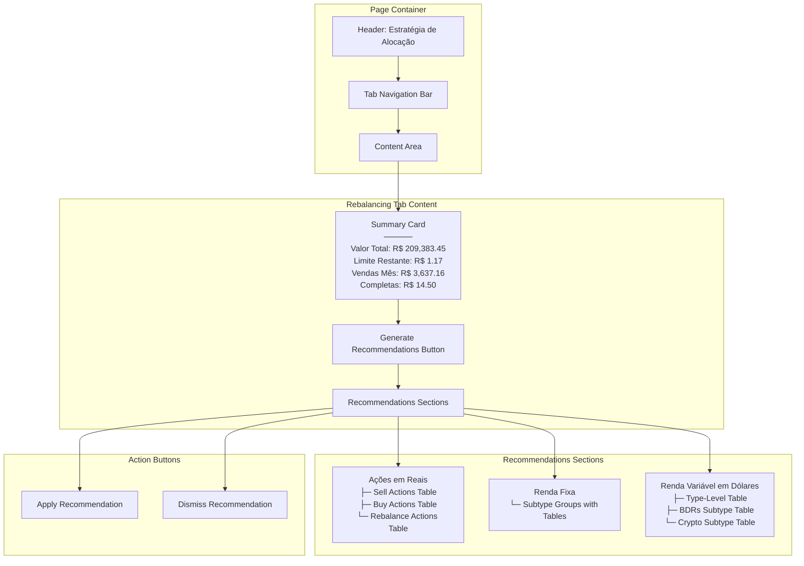

## Visual Component Mockup

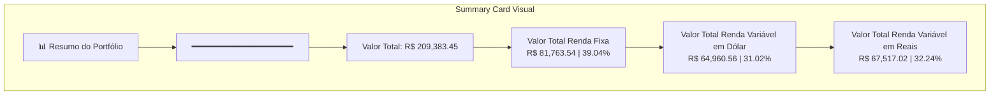

## Table Structure Mockup

```mermaid
graph TB
    subgraph "Type-Level Actions Table"
        A1["┌─────────────────────────────────────────────────────────┐"]
        A2["│ Tipo │ Valor Atual │ Valor Alvo │ Diferença │ Ação    │"]
        A3["├─────────────────────────────────────────────────────────┤"]
        A4["│ Renda Variável │ R$ 63,907.56 │ R$ 9,417.87 │ -54,489 │ Manter │"]
        A5["└─────────────────────────────────────────────────────────┘"]
    end
    
    subgraph "Subtype Actions Table - BDRs"
        B1["┌────────────────────────────────────────────────────────────────────────┐"]
        B2["│ Ticker │ Nome │ Valor Atual │ Valor Alvo │ Diferença │ Ação          │"]
        B3["├────────────────────────────────────────────────────────────────────────┤"]
        B4["│ BERK34 │ ... │ R$ 40,148.14 │ R$ 62,785.83 │ +22,637 │ Comprar 166   │"]
        B5["└────────────────────────────────────────────────────────────────────────┘"]
    end
    
    subgraph "Subtype Actions Table - Crypto"
        C1["┌────────────────────────────────────────────────────────────────────────┐"]
        C2["│ Ticker │ Nome │ Valor Atual │ Valor Alvo │ Diferença │ Ação          │"]
        C3["├────────────────────────────────────────────────────────────────────────┤"]
        C4["│ BTC    │ Bitcoin │ R$ 23,759.42 │ R$ 9,417.87 │ -14,341 │ Manter        │"]
        C5["└────────────────────────────────────────────────────────────────────────┘"]
    end
    
    A1 --> A2
    A2 --> A3
    A3 --> A4
    A4 --> A5
    
    B1 --> B2
    B2 --> B3
    B3 --> B4
    B4 --> B5
    
    C1 --> C2
    C2 --> C3
    C3 --> C4
    C4 --> C5
```

## Responsive Behavior

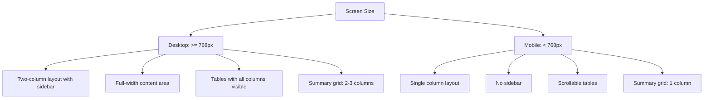

## State Management

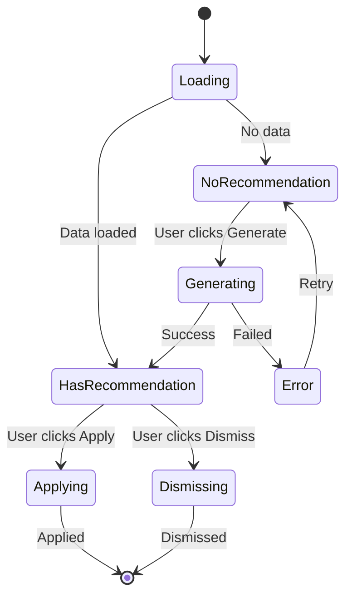

## Detailed Visual Mockup

### Complete Page Layout

```
┌─────────────────────────────────────────────────────────────────────────────────────┐
│  Estratégia de Alocação                                                             │
│                                                                                     │
│  ┌──────────────────┐  ┌──────────────────────┐                                     │
│  │  Configuração    │  │  Rebalanceamento     │                                     │
│  └──────────────────┘  └──────────────────────┘                                     │
│                                                                                     │
│  ┌──────────────────────────────────────────────────────────────────────────────┐   │
│  │  [Gerar Recomendações de Rebalanceamento]  (Primary Blue Button)             │   │
│  └──────────────────────────────────────────────────────────────────────────────┘   │
│  ┌──────────────────────────────────────────────────────────────────────────────┐   │
│  │ Resumo do Portfólio                       - Valor Total   R$ 209,383.45      │   │
│  ├──────────────────────────────────────────────────────────────────────────────┤   │
│  │                                                                              │   │
│  │  ┌──────────────────────────────────────┬───────────────────┐                │   │
│  │  │ Valor Total Renda Fixa               │ Percentual        │                │   │
│  │  │  R$ 81,763.54                        │ 39,04%            │                │   │
│  │  └──────────────────────────────────────┴───────────────────┘                │   │
│  │  ┌──────────────────────────────────────┬───────────────────┐                │   │
│  │  │ Valor Total Renda Variável em Dólar  │ Percentual        │                │   │
│  │  │  R$ 64,960.56                        │ 31.02%            │                │   │
│  │  └──────────────────────────────────────┴───────────────────┘                │   │
│  │  ┌──────────────────────────────────────┬───────────────────┐                │   │
│  │  │ Valor Total Renda Variável em Reais  │ Percentual        │                │   │
│  │  │  R$ 67,517.02                        │ 32.24             │                │   │
│  │  └──────────────────────────────────────┴───────────────────┘                │   │
│  └──────────────────────────────────────────────────────────────────────────────┘   │
│                                                                                     │
└─────────────────────────────────────────────────────────────────────────────────────┘

```
### Renda Fixa Section

```
┌─────────────────────────────────────────────────────────────────────────────────────────────────────────────────┐
│  Renda Fixa - Rebalanceamento                                                                                   │
│  ┌─ Type-Level Summary ──────────────────────────────────────────────────────────────────────────────────────┐  │
│  │                                                                                                           │  │
│  │  ┌──────────────────────────────┬──────────────┬──────────────┬─────────────┬────────────────┐            │  │
│  │  │ Tipo                         │ Valor Atual  │ Valor Alvo   │ Diferença   │  Recomendação  │            │  │
│  │  ├──────────────────────────────┼──────────────┼──────────────┼─────────────┼────────────────┤            │  │
│  │  │ Renda Fixa                   │ R$ 81,763.54 │ R$ 84,149.59 │ R$ 2,386.05 │     Aumentar   │            │  │
│  │  └──────────────────────────────┴──────────────┴──────────────┴─────────────┴────────────────┘            │  │
│  │                                                                                                           │  │
│  │  ┌─ SubType-Level Summary ─────────────────────────────────────────────────────────────────────────────┐  │  │
│  │  │                                                                                                     │  │  │
│  │  │  ┌─ Caixa ───────────────────────────────────────────────────────────────────────────────────────┐  │  │  │
│  │  │  │                                                                                               │  │  │  │
│  │  │  │  ┌────────────────────────────┬──────────────┬──────────────┬───────────────┬──────────────┐  │  │  │  │
│  │  │  │  │ Sub-Tipo de Investimento   │ Valor Atual  │ Valor Alvo   │ Diferença     │ Recomendação │  │  │  │  │
│  │  │  │  ├────────────────────────────┼──────────────┼──────────────┼───────────────┼──────────────┤  │  │  │  │
│  │  │  │  │ XP Conta Investimento      │ R$ 1,296.17  │ R$ 500,00    │ R$ -796,17    │ Reduzir      │  │  │  │  │
│  │  │  │  └────────────────────────────┴──────────────┴──────────────┴───────────────┴──────────────┘  │  │  │  │
│  │  │  │                                                                                               │  │  │  │
│  │  │  └───────────────────────────────────────────────────────────────────────────────────────────────┘  │  │  │
│  │  │                                                                                                     │  │  │
│  │  │  ┌─ Tesouro Direto ──────────────────────────────────────────────────────────────────────────────┐  │  │  │
│  │  │  │                                                                                               │  │  │  │
│  │  │  │  ┌────────────────────────────┬──────────────┬──────────────┬───────────────┬──────────────┐  │  │  │  │
│  │  │  │  │ Sub-Tipo de Investimento   │ Valor Atual  │ Valor Alvo   │ Diferença     │ Recomendação │  │  │  │  │
│  │  │  │  ├────────────────────────────┼──────────────┼──────────────┼───────────────┼──────────────┤  │  │  │  │
│  │  │  │  │ Tesouro Direto             │ R$ 64,867.85 │ R$ 52,595.19 │ R$ -12,272.66 │  Reduzir     │  │  │  │  │
│  │  │  │  └────────────────────────────┴──────────────┴──────────────┴───────────────┴──────────────┘  │  │  │  │
│  │  │  │                                                                                               │  │  │  │
│  │  │  └───────────────────────────────────────────────────────────────────────────────────────────────┘  │  │  │
│  │  │                                                                                                     │  │  │
│  │  │  ┌─ CDB ─────────────────────────────────────────────────────────────────────────────────────────┐  │  │  │
│  │  │  │                                                                                               │  │  │  │
│  │  │  │  ┌────────────────────────────┬──────────────┬──────────────┬───────────────┬──────────────┐  │  │  │  │
│  │  │  │  │ Sub-Tipo de Investimento   │ Valor Atual  │ Valor Alvo   │ Diferença     │ Recomendação │  │  │  │  │
│  │  │  │  ├────────────────────────────┼──────────────┼──────────────┼───────────────┼──────────────┤  │  │  │  │
│  │  │  │  │ CDB Pré-Fixado             │ R$ 20,000.00 │ R$ 20,918.12 │ +918.12       │ Aumentar     │  │  │  │  │
│  │  │  │  └────────────────────────────┴──────────────┴──────────────┴───────────────┴──────────────┘  │  │  │  │
│  │  │  │                                                                                               │  │  │  │
│  │  │  └───────────────────────────────────────────────────────────────────────────────────────────────┘  │  │  │
│  │  └─────────────────────────────────────────────────────────────────────────────────────────────────────┘  │  │ 
│  └───────────────────────────────────────────────────────────────────────────────────────────────────────────┘  │
└─────────────────────────────────────────────────────────────────────────────────────────────────────────────────┘
```

### Renda Variável em Dólares Section

```
┌───────────────────────────────────────────────────────────────────────────────────────────────────────────┐
│  Renda Variável em Dólares - Rebalanceamento                                                              │
│                                                                                                           │
│  ┌─ Type-Level Summary ───────────────────────────────────────────────────────────────────────────────┐   │
│  │                                                                                                    │   │
│  │  ┌──────────────────────────────┬──────────────┬──────────────┬─────────────┬─────────┐            │   │
│  │  │ Tipo                         │ Valor Atual  │ Valor Alvo   │ Diferença   │  Ação   │            │   │
│  │  ├──────────────────────────────┼──────────────┼──────────────┼─────────────┼─────────┤            │   │
│  │  │ Renda Variável em Dólares    │ R$ 63,907.56 │ R$ 62,785.83 │ -1,121.73   │ Reduzir │            │   │
│  │  └──────────────────────────────┴──────────────┴──────────────┴─────────────┴─────────┘            │   │
│  │  ┌─ SubType-Level Summary ─────────────────────────────────────────────────────────────────────┐   │   │
│  │  │  ┌─ BDRs ───────────────────────────────────────────────────────────────────────────────┐   │   │   │
│  │  │  │  ┌────────┬─────────────────────────┬──────────────┬──────────────┬───────────────┐  │   │   │   │
│  │  │  │  │ Ticker │ Nome                    │ Valor Atual  │ Valor Alvo   │ Ação          │  │   │   │   │
│  │  │  │  ├────────┼─────────────────────────┼──────────────┼──────────────┼───────────────┤  │   │   │   │
│  │  │  │  │ BERK34 │ Berkshire Hathaway Inc. │ R$ 40,148.14 │ R$ 31,392.91 │ Vender [64]   │  │   │   │   │
│  │  │  │  └────────┴─────────────────────────┴──────────────┴──────────────┴───────────────┘  │   │   │   │
│  │  │  └──────────────────────────────────────────────────────────────────────────────────────┘   │   │   │
│  │  │                                                                                             │   │   │
│  │  │  ┌─ Crypto ─────────────────────────────────────────────────────────────────────────────┐   │   │   │
│  │  │  │  ┌────────┬───────────────┬──────────────┬──────────────┬─────────────────────────┐  │   │   │   │
│  │  │  │  │ Ticker │ Nome          │ Valor Atual  │ Valor Alvo   │ Ação                    │  │   │   │   │
│  │  │  │  ├────────┼───────────────┼──────────────┼──────────────┼─────────────────────────┤  │   │   │   │
│  │  │  │  │ BTC    │ Bitcoin       │ R$ 23,759.42 │ R$ 31,392.91 │ Comprar [0.01662763]    │  │   │   │   │
│  │  │  │  └────────┴───────────────┴──────────────┴──────────────┴─────────────────────────┘  │   │   │   │
│  │  │  └──────────────────────────────────────────────────────────────────────────────────────┘   │   │   │
│  │  └─────────────────────────────────────────────────────────────────────────────────────────────┘   │   │  
│  └────────────────────────────────────────────────────────────────────────────────────────────────────┘   │
└───────────────────────────────────────────────────────────────────────────────────────────────────────────┘
```

### Ações em Reais Section

```
┌───────────────────────────────────────────────────────────────────────────────────────────────────────────────┐
│  Renda Variável em Reais - Rebalanceamento                                                                    │
│                                                                                                               │
│  ┌─ Type-Level Summary ────────────────────────────────────────────────────────────────────────────────────┐  │
│  │                                                                                                         │  │
│  │  ┌──────────────────────────────┬──────────────┬──────────────┬─────────────┬─────────┐                 │  │
│  │  │ Tipo                         │ Valor Atual  │ Valor Alvo   │ Diferença   │  Ação   │                 │  │
│  │  ├──────────────────────────────┼──────────────┼──────────────┼─────────────┼─────────┤                 │  │
│  │  │ Renda Variável em Reais      │ R$ 63,907.56 │ R$ 62,785.83 │ -1,121.73   │ Reduzir │                 │  │
│  │  └──────────────────────────────┴──────────────┴──────────────┴─────────────┴─────────┘                 │  │
│  │  ┌──────────────────────────────┐  ┌──────────────────────────────┐                                     │  │
│  │  │ Vendas Já Realizadas no Mês  │  │ Limite Disponível para Vendas│                                     │  │
│  │  │ R$ 3,637.16                  │  │ R$ 15,362.84                 │                                     │  │
│  │  └──────────────────────────────┘  └──────────────────────────────┘                                     │  │
│  │  ┌─ SubType-Level Summary ───────────────────────────────────────────────────────────────────────────┐  │  │
│  │  │  ┌─ Ações em Reais - Vender ────────────────────────────────────────────────────────────┐         │  │  │
│  │  │  │  ┌───────┬────────┬─────────────────────────┬──────────────┬──────────┬─────────┐    │         │  │  │
│  │  │  │  │ Rank  │ Ticker │ Nome                    │ Valor Atual  │ Quant.   │ Motivo  │    │         │  │  │  
│  │  │  │  │ 35    │ ITUB4  │ Itaú Unibanco Holding   │ R$ 5,234.56  │   100    │ Rank>30 │    │         │  │  │
│  │  │  │  │ 40    │ VALE3  │ Vale S.A.               │ R$ 8,123.45  │    50    │ Rank>30 │    │         │  │  │
│  │  │  │  └───────┴────────┴─────────────────────────┴──────────────┴──────────┴─────────┘    │         │  │  │
│  │  │  └──────────────────────────────────────────────────────────────────────────────────────┘         │  │  │
│  │  │  ┌──────────────────────────────┐  ┌──────────────────────────────┐                               │  │  │
│  │  │  │ Total Vendas - Liquidadas    │  │ Limite para Vendas Parciais  │                               │  │  │
│  │  │  │ R$ 13,358.01                 │  │ R$ 2,004.83                  │                               │  │  │
│  │  │  └──────────────────────────────┘  └──────────────────────────────┘                               │  │  │
│  │  │  ┌─ Ações em Reais - Comprar ───────────────────────────────────────────────────────────┐         │  │  │
│  │  │  │  ┌───────┬────────┬─────────────────────────┬──────────────┬──────────┐              │         │  │  │
│  │  │  │  │ Rank  │ Ticker │ Nome                    │ Valor Alvo   │ Quant.   │              │         │  │  │
│  │  │  │  ├───────┼────────┼─────────────────────────┼──────────────┼──────────┤              │         │  │  │
│  │  │  │  │  3    │ PETR4  │ Petróleo Brasileiro     │ R$ 15,678.90 │   200    │              │         │  │  │
│  │  │  │  │  5    │ BBDC4  │ Banco Bradesco          │ R$ 12,345.67 │   150    │              │         │  │  │
│  │  │  │  └───────┴────────┴─────────────────────────┴──────────────┴──────────┘              │         │  │  │
│  │  │  └──────────────────────────────────────────────────────────────────────────────────────┘         │  │  │
│  │  │  ┌─ Ações em Reais - Rebalancear ──────────────────────────────────────────────────────────────┐  │  │  │
│  │  │  │  ┌─────┬────────┬────────────────┬──────────────┬──────────────┬─────────┬───────────────┐  │  │  │  │
│  │  │  │  │Rank │ Ticker │ Nome           │ Valor Atual  │ Valor Alvo   │ Dif.    │ Ação          │  │  │  │  │
│  │  │  │  ├─────┼────────┼────────────────┼──────────────┼──────────────┼─────────┼───────────────┤  │  │  │  │
│  │  │  │  │  2  │ ABEV3  │ Ambev S.A.     │ R$ 20,000.00 │ R$ 18,500.00 │ -1,500  │ Vender [25]   │  │  │  │  │
│  │  │  │  │  8  │ WEGE3  │ WEG S.A.       │ R$ 10,000.00 │ R$ 12,000.00 │ +2,000  │ Comprar [10]  │  │  │  │  │
│  │  │  │  └─────┴────────┴────────────────┴──────────────┴──────────────┴─────────┴───────────────┘  │  │  │  │
│  │  │  │  ┌──────────────────────────────┐   ┌──────────────────────────────┐                        │  │  │  │
│  │  │  │  │ Vendas Parciais              │   │ Limite de Vendas Restante    │                        │  │  │  │
│  │  │  │  │ R$ 1,500,.00                 │   │ R$ 504.83                    │                        │  │  │  │
│  │  │  │  └──────────────────────────────┘   └──────────────────────────────┘                        │  │  │  │
│  │  │  │                                                                                             │  │  │  │
│  │  │  └─────────────────────────────────────────────────────────────────────────────────────────────┘  │  │  │
│  │  └───────────────────────────────────────────────────────────────────────────────────────────────────┘  │  │  
│  └─────────────────────────────────────────────────────────────────────────────────────────────────────────┘  │
└───────────────────────────────────────────────────────────────────────────────────────────────────────────────┘
```


## Visual Design Specifications

### Color Palette

```
Primary Colors:
├── Primary Blue:      #0071e3 (Buttons, links, active states)
├── Primary Blue Hover:#0077ed (Button hover state)
├── Primary Blue Light:#e8f4fd (Background highlights)

Neutral Colors:
├── Background:        #f5f5f7 (Main page background)
├── White:             #ffffff (Cards, panels)
├── Text Primary:      #1d1d1f (Main text)
├── Text Secondary:    #86868b (Secondary text, labels)
├── Border:            #e5e5e7 (Borders, dividers)

Status Colors:
├── Success/Positive:  #34c759 (Green - Buy actions, positive values)
├── Danger/Negative:   #d70015 (Red - Sell actions, negative values)
├── Warning/Maintain:  #ff9500 (Yellow/Orange - Maintain actions)
└── Error:             #d70015 (Error messages, warnings)
```

### Typography

```
Headers:
├── H2 (Page Title):    2rem (32px), weight: 600, letter-spacing: -0.02em
├── H4 (Section Title): 1.1rem (17.6px), weight: 600
└── H5 (Subsection):    1rem (16px), weight: 600

Body:
├── Body Text:          0.9375rem (15px), weight: 400
├── Small Text:         0.875rem (14px), weight: 400
└── Labels:             0.8125rem (13px), weight: 400, color: --text-secondary

Numbers:
└── Monetary Values:    Same as body, formatted with R$ prefix and 2 decimal places
```

### Spacing & Layout

```
Container Spacing:
├── Page Padding:       2rem (32px) all sides
├── Card Padding:       1.5rem (24px) all sides
├── Section Gap:        2rem (32px) between sections
└── Element Gap:        1rem (16px) between related elements

Card Dimensions:
├── Border Radius:      8px
├── Box Shadow:         0 2px 4px rgba(0, 0, 0, 0.1)
└── Border:             1px solid var(--border)

Grid Layouts:
├── Summary Grid:       CSS Grid, 2-3 columns on desktop, 1 column on mobile
└── Table Layout:       Full width, scrollable on mobile
```

### Component Styles

#### Summary Card

```
┌─────────────────────────────────────────────────────┐
│ Background: #ffffff                                  │
│ Padding: 1.5rem                                      │
│ Border-radius: 8px                                   │
│ Box-shadow: 0 2px 4px rgba(0, 0, 0, 0.1)            │
│                                                       │
│ Title: H4, color: --text-primary                     │
│                                                       │
│ Summary Header:                                       │
│   - Title: H4, color: --text-primary                 │
│   - Total Value: Large, bold (1.5rem, weight: 600)   │
│   - Margin-bottom: 1rem                               │
│                                                       │
│ Summary Grid:                                         │
│   - Display: grid                                    │
│   - Grid-template-columns: 1fr                        │
│   - Gap: 1rem                                        │
│                                                       │
│ Summary Item:                                         │
│   - Display: grid                                    │
│   - Grid-template-columns: 1fr auto                  │
│   - Gap: 1rem                                        │
│   - Padding: 0.75rem                                  │
│   - Border: 1px solid var(--border)                  │
│   - Border-radius: 4px                               │
│                                                       │
│ Summary Label:                                        │
│   - Font-size: 0.8125rem                             │
│   - Color: --text-secondary                           │
│   - Margin-bottom: 0.25rem                            │
│                                                       │
│ Summary Value:                                        │
│   - Font-size: 0.9375rem                             │
│   - Font-weight: 400                                 │
│   - Color: --text-primary                            │
│                                                       │
│ Summary Percentage:                                   │
│   - Font-size: 0.9375rem                             │
│   - Font-weight: 400                                 │
│   - Color: --text-primary                            │
│   - Text-align: right                                │
└─────────────────────────────────────────────────────┘
```

#### Tables

```
┌─────────────────────────────────────────────────────┐
│ Actions Table:                                       │
│   - Width: 100%                                      │
│   - Border-collapse: collapse                        │
│   - Background: #ffffff                              │
│                                                       │
│ Table Header:                                        │
│   - Background: #f5f5f7                              │
│   - Font-weight: 600                                 │
│   - Font-size: 0.875rem                              │
│   - Padding: 0.75rem 1rem                            │
│   - Text-align: left                                 │
│   - Border-bottom: 1px solid var(--border)           │
│                                                       │
│ Table Row:                                           │
│   - Padding: 0.75rem 1rem                            │
│   - Border-bottom: 1px solid var(--border)           │
│   - Hover: background: #f8f9fa                       │
│   - Alternating rows: background: #fafafa            │
│                                                       │
│ Table Cell:                                          │
│   - Font-size: 0.9375rem                             │
│   - Color: --text-primary                            │
│   - Ticker: font-weight: 600                         │
└─────────────────────────────────────────────────────┘
```

#### Badges

```
Buy Badge (Comprar):
├── Background: #34c759 (Green)
├── Color: #ffffff
├── Padding: 0.25rem 0.75rem
├── Border-radius: 12px
├── Font-size: 0.875rem
└── Font-weight: 600

Sell Badge (Vender):
├── Background: #d70015 (Red)
├── Color: #ffffff
├── Padding: 0.25rem 0.75rem
├── Border-radius: 12px
├── Font-size: 0.875rem
└── Font-weight: 600

Maintain Badge (Manter):
├── Background: #ff9500 (Orange/Yellow)
├── Color: #ffffff
├── Padding: 0.25rem 0.75rem
├── Border-radius: 12px
├── Font-size: 0.875rem
└── Font-weight: 600
```

#### Buttons

```
Primary Button:
├── Background: #0071e3
├── Color: #ffffff
├── Padding: 0.75rem 1.5rem
├── Border-radius: 8px
├── Font-size: 0.9375rem
├── Font-weight: 600
├── Border: none
├── Hover: background: #0077ed
└── Disabled: opacity: 0.5, cursor: not-allowed

Success Button (Apply):
├── Background: #34c759
├── Same styling as Primary
└── Hover: background: #30b04f

Secondary Button (Dismiss):
├── Background: #86868b
├── Same styling as Primary
└── Hover: background: #75757a
```

### Interactive States

```
Hover States:
├── Buttons: Lighter shade of base color
├── Table Rows: Background: #f8f9fa
└── Links: Underline on hover

Focus States:
├── Buttons: Outline: 2px solid #0071e3, outline-offset: 2px
├── Inputs: Border: 2px solid #0071e3
└── Tabs: Bottom border: 2px solid #0071e3

Disabled States:
├── Opacity: 0.5
├── Cursor: not-allowed
└── Pointer-events: none

Loading States:
├── Button text: "Gerando..." with spinner
├── Disabled: true
└── Cursor: wait
```

### Warning Banners

```
Warning Banner:
├── Background: #fff5f5
├── Border: 1px solid #ffebee
├── Color: #d70015
├── Padding: 0.75rem 1rem
├── Border-radius: 8px
├── Font-size: 0.875rem
└── Margin-bottom: 1rem
```

### Section Groups

```
Type Action Group:
├── Background: #ffffff
├── Padding: 1rem
├── Border-radius: 8px
├── Box-shadow: 0 2px 4px rgba(0, 0, 0, 0.1)
└── Margin-bottom: 1rem

Subtype Action Group:
├── Background: #f8f9fa
├── Padding: 1rem
├── Border-radius: 8px
├── Border-left: 4px solid #0071e3
├── Margin-top: 1rem
└── Margin-bottom: 1rem
```

## Exact Presentation Details

### Summary Card - Visual Example

```
┌─────────────────────────────────────────────────────────────────┐
│  📊 Resumo do Portfólio                                         │
│  ───────────────────────────────────────────────────────────────│
│                                                                   │
│  Valor Total: R$ 209,383.45                                      │
│  (Large, bold, dark text)                                        │
│                                                                   │
│  ┌──────────────────────────────────────┬───────────────────┐    │
│  │ Valor Total Renda Fixa               │ Percentual        │    │
│  │ R$ 81,763.54                         │ 39.04%            │    │
│  │ (Normal text)                        │ (Normal text)     │    │
│  └──────────────────────────────────────┴───────────────────┘    │
│                                                                   │
│  ┌──────────────────────────────────────┬───────────────────┐    │
│  │ Valor Total Renda Variável em Dólar   │ Percentual        │    │
│  │ R$ 64,960.56                         │ 31.02%            │    │
│  │ (Normal text)                        │ (Normal text)     │    │
│  └──────────────────────────────────────┴───────────────────┘    │
│                                                                   │
│  ┌──────────────────────────────────────┬───────────────────┐    │
│  │ Valor Total Renda Variável em Reais   │ Percentual        │    │
│  │ R$ 67,517.02                         │ 32.24%            │    │
│  │ (Normal text)                        │ (Normal text)     │    │
│  └──────────────────────────────────────┴───────────────────┘    │
│                                                                   │
└─────────────────────────────────────────────────────────────────┘
```

### Table Row Example - BERK34

```
┌────────────────────────────────────────────────────────────────────┐
│  [BDRs Subsection Header]                                          │
│  ──────────────────────────────────────────────────────────────────│
│                                                                     │
│  ┌──────┬──────────────┬────────────┬────────────┬─────────┬─────┐│
│  │Ticker│ Nome         │ Valor Atual│ Valor Alvo │ Diferença│Ação││
│  ├──────┼──────────────┼────────────┼────────────┼─────────┼─────┤│
│  │BERK34│ Berkshire    │ R$         │ R$         │ R$      │[🟢]││
│  │[Bold]│ Hathaway Inc.│ 40,148.14  │ 62,785.83  │ 22,637.69│    ││
│  │      │              │            │            │[Green]  │Comprar││
│  │      │              │            │            │         │166   ││
│  └──────┴──────────────┴────────────┴────────────┴─────────┴─────┘│
│                                                                     │
└────────────────────────────────────────────────────────────────────┘
```

### Badge Visual Details

```
Buy Badge:
┌──────────────────┐
│ Comprar 166      │  ← Green background (#34c759)
│ [rounded corners]│     White text
│                  │     Font: 0.875rem, weight: 600
└──────────────────┘

Sell Badge:
┌──────────────────┐
│ Vender 100       │  ← Red background (#d70015)
│ [rounded corners]│     White text
│                  │     Font: 0.875rem, weight: 600
└──────────────────┘

Maintain Badge:
┌──────────────────┐
│ Manter           │  ← Orange/Yellow background (#ff9500)
│ [rounded corners]│     White text
│                  │     Font: 0.875rem, weight: 600
└──────────────────┘
```

## Notes

1. **Summary Card**: Displays the total portfolio value in the header, followed by a breakdown of investment types (Renda Fixa, Renda Variável em Dólar, Renda Variável em Reais) showing both the monetary value and percentage allocation for each type.

2. **Table Structure**: All tables use a consistent design with clear headers, alternating row colors, and action badges (buy/sell/maintain).

3. **Subtype Grouping**: Investment types with subtypes are organized hierarchically, showing type-level totals followed by subtype-specific recommendations.

4. **Action Badges**: 
   - Green badge for "Comprar" (Buy) actions
   - Red badge for "Vender" (Sell) actions
   - Yellow badge for "Manter" (Maintain) actions

5. **Color Coding**: 
   - Positive differences shown in green
   - Negative differences shown in red
   - Warning states for approaching limits

6. **Responsive Design**: The layout adapts to screen size, with tables becoming scrollable on mobile devices.

7. **Visual Hierarchy**: Type-level actions appear at the top in their own section, followed by subtype groups with blue left border separator.

8. **Typography**: Clear hierarchy with section titles (H4), subsection titles (H5), and consistent body text sizing.

9. **Spacing**: Generous whitespace between sections (2rem) and within cards (1.5rem padding) for readability.

10. **Interactive Elements**: Buttons have clear hover states, tables have row hover effects, and focus states are visible for accessibility.

