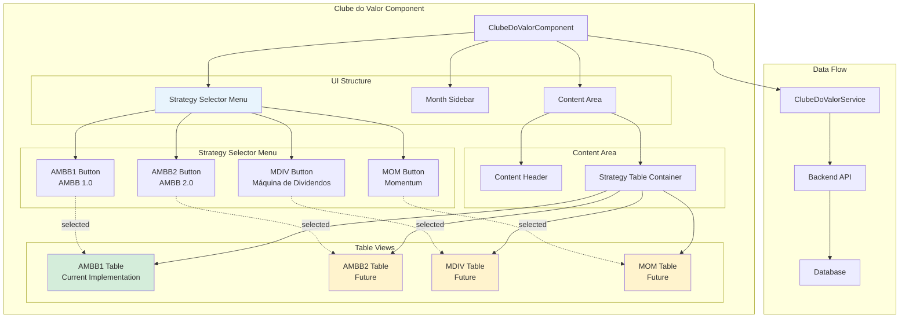
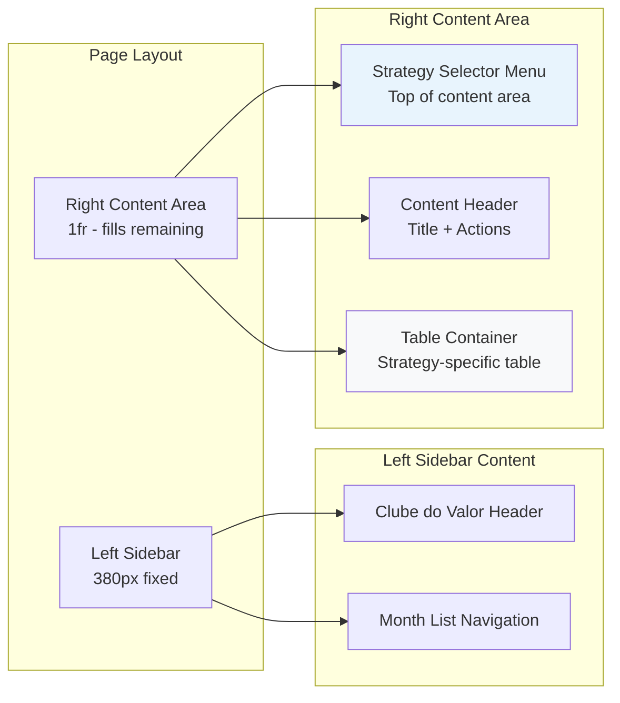
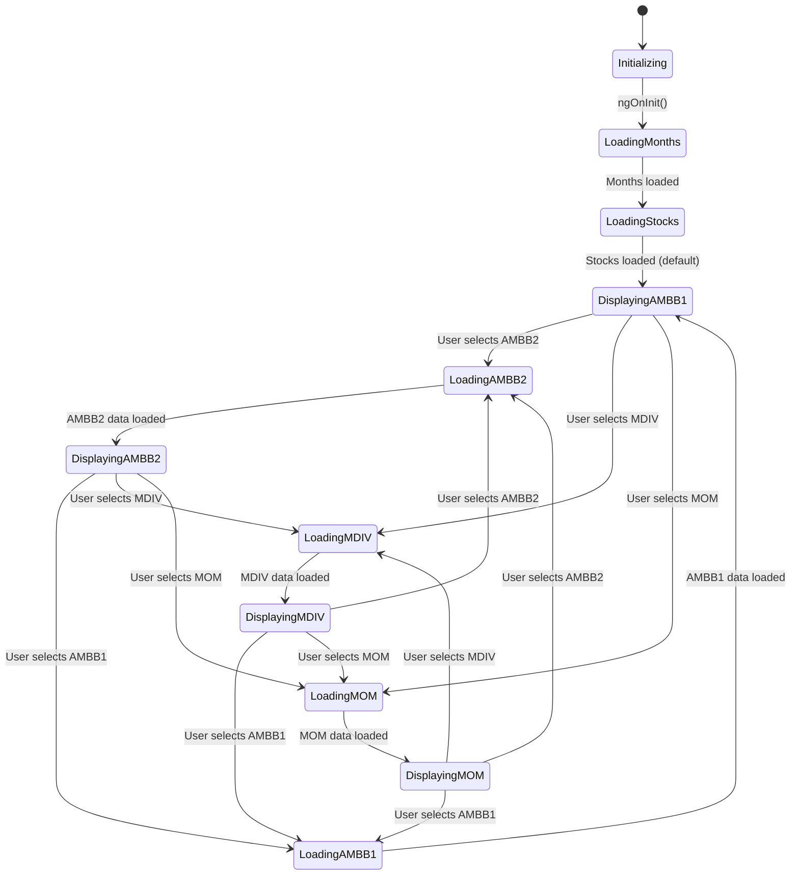
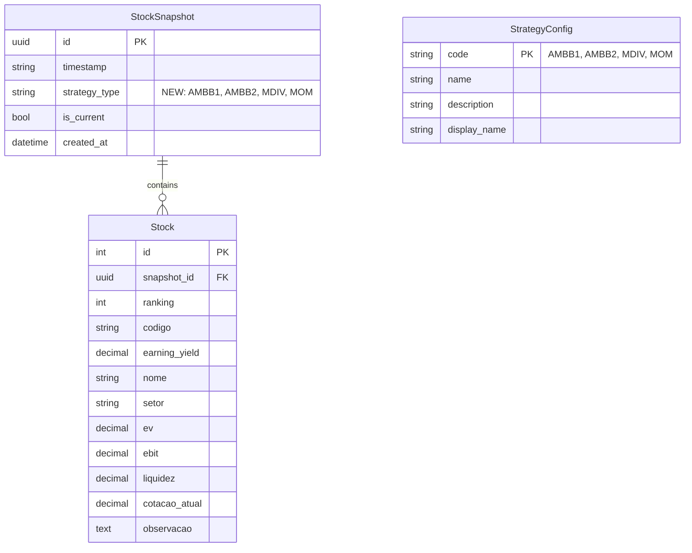
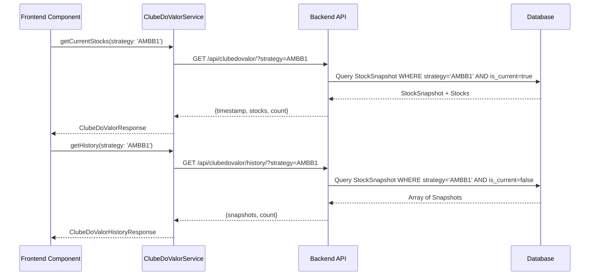
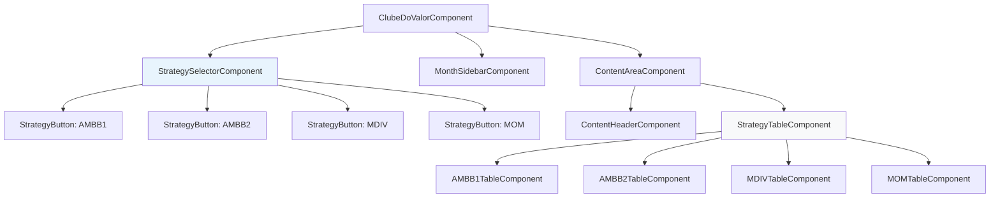
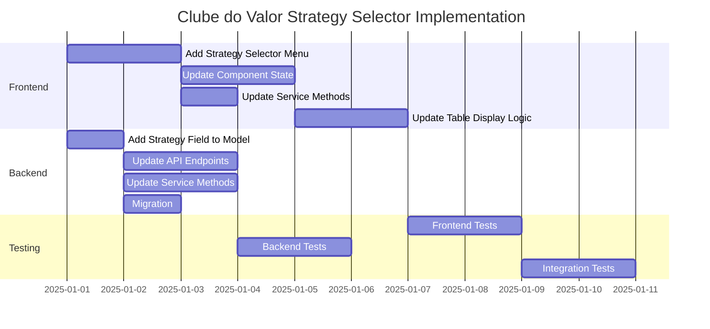

# Clube do Valor - Strategy Selector Design

## Component Structure Diagram

## Layout Structure

## Component State Management

## Data Model Changes

## API Endpoint Changes

## UI Component Hierarchy

## Implementation Phases

